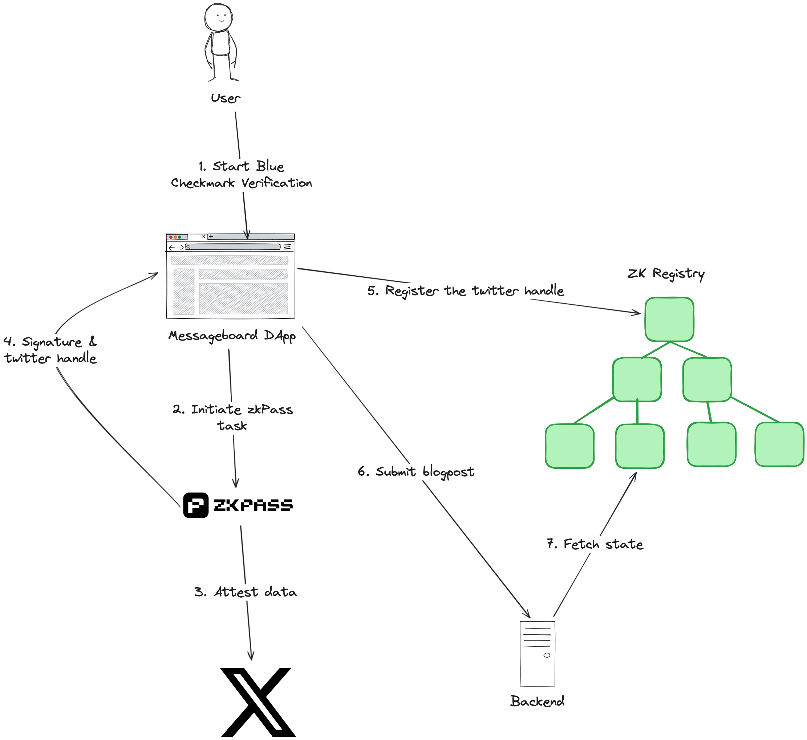

# ZK Registry Workshop #1: Building a bot free message board with ZK Blue Tick Registry

## What are we trying to build

We want a simple anonymous message board where user can:

- Verify X Blue Check ownership via zkPass
- See the entire list of posts
- Anonymously post a message(checkmark verification is required!)
- Attach a single image to the post

## Architecture

Key components:

- Custom zkPass schema for X Blue Checkmarks
- React front-end
- Node.js backend
- Mongo DB for posts and images
- ZK Registry smart-contracts. Upon registration, the smart-contract must verify the [zkPass allocator signature](https://zkpass.gitbook.io/zkpass/developer-guides/extension-js-sdk/generate-proof-and-verify-the-result/evm#verify-allocator-signature) and use the Twitter handle as a nullifier: https://github.com/openioncom/zkpass-registry-contracts/releases/tag/v1.0.0




## Pre-requisites

1. **Install Node.js** (if not installed)
   Download and install from: [https://nodejs.org/](https://nodejs.org/)

1. **Install Yarn**
   Run one of the following commands:

   - Using Corepack (recommended for Node.js 16.10+):
     ```
     corepack enable
     ```
   - Using npm:
     ```
     npm install -g yarn
     ```
1. Get an instance of MongoDB running locally or use a cloud service like MongoDB Atlas.
1. Follow instructions in [client](/client/README.md) and [server](/server/README.md) READMEs to set up the client and server.
